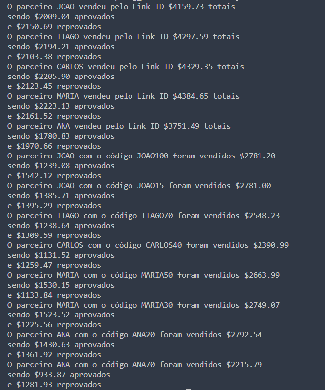

# Desafio técnico WAG

O objetivo é mensurar o desempenho de cinco parceiros descritos na aba 'Link Ids': João, Tiago, Carlos, Maria e Ana.
Observa-se que cada parceiro possui seu próprio Link ID associado e também tem cupons associados descritos na aba 'Voucher Codes'.
Essa análise procura responder às seguintes perguntas:

- Quanto cada parceiro vendeu nos seus respectivos links associados ?
- Quanto cada parceiro vendeu considerando o somatório dos seus cupons associados?

###### Como executar

Dentro da pasta src utilizar o comando

```
node index.js
```

###### Resultado

A saída exibirá, por parceiro, o valor de vendas totais, vendas aprovadas e reprovadas pelo link Id,

 além do valor de vendas totais, vendas aprovadas e reprovadas pelo voucher code. A seguir é possível a saída.



